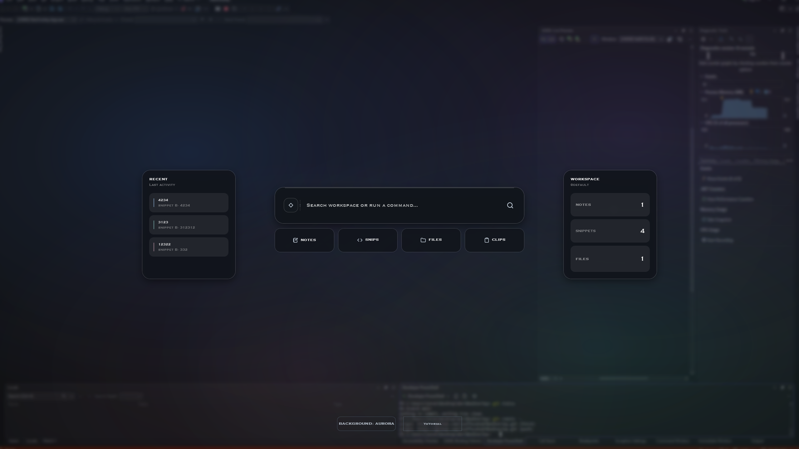
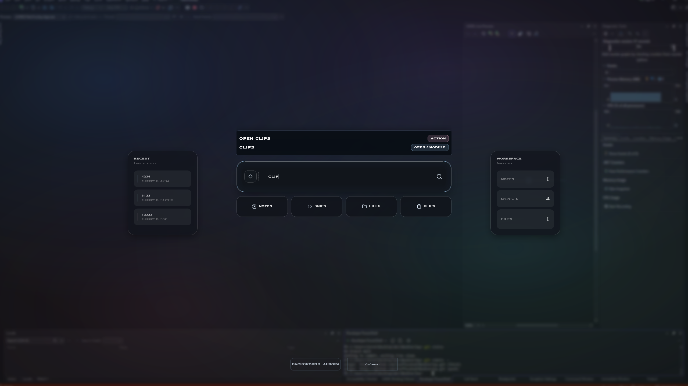
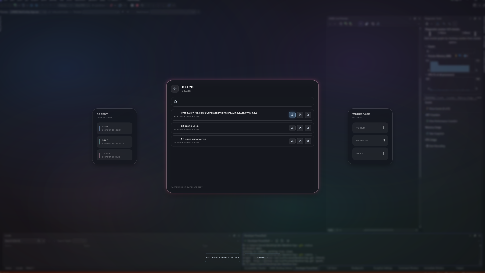
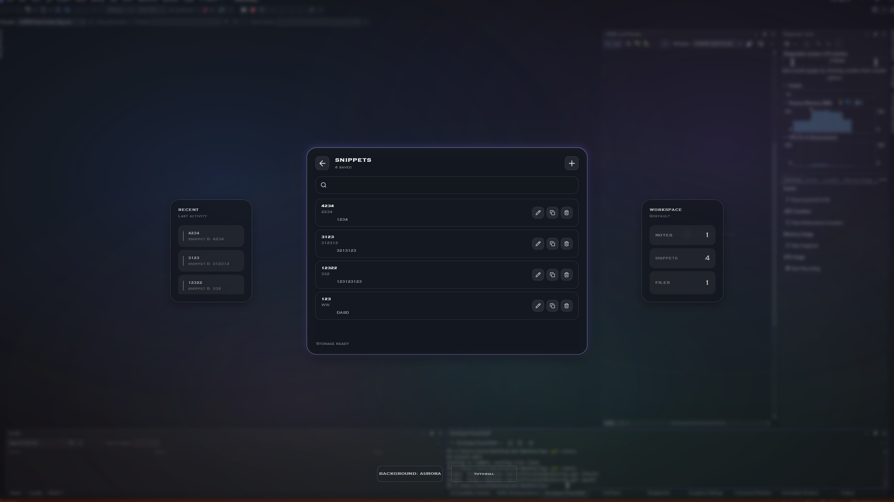
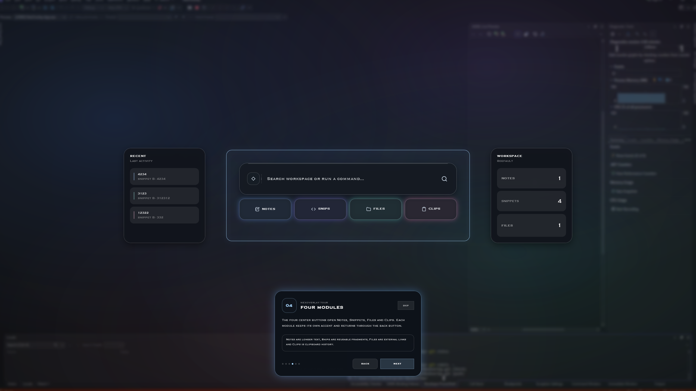

<div align="center">

# NexOverlay

**A local-first Windows overlay for notes, snippets, files and clipboard history.**

Open your workspace without leaving the app, game, editor or browser you are currently using.

[](https://github.com/isuffocated/NexOverlay/actions/workflows/ci.yml)

</div>

<p align="center">
  
</p>

## What is NexOverlay?

NexOverlay is a Windows desktop overlay built with **C# / .NET 10 / WPF**.

It provides a fast workspace for things that normally end up scattered across Notepad, browser tabs, Explorer windows and clipboard history.

The overlay stays out of the way until it is needed, then opens on the monitor currently under the cursor.

### Core modules

- **Notes** - create, edit, search and delete local notes.
- **Snippets** - store reusable text/code with categories and quick copy actions.
- **Files** - keep shortcuts to frequently used files without moving or duplicating them.
- **Clips** - searchable clipboard history with pinning, copy and delete actions.

Everything is stored locally.

## Command palette

The central search field doubles as a command palette.

It can:

- open NexOverlay modules;
- create new notes and snippets;
- add files;
- search Notes, Snippets, Files and Clips;
- surface actions and matching workspace content from one place.

<p align="center">
  
</p>

## Clipboard history

Clips keeps recent clipboard entries inside NexOverlay and lets you search, copy, pin or remove them.

Pinned entries stay available while the unpinned history is automatically bounded.

<p align="center">
  
</p>

## Snippets

Snippets are intended for content you want to reuse repeatedly: commands, code, templates, URLs, messages or anything else worth keeping close.

<p align="center">
  
</p>

## Guided onboarding

The first overlay session includes a contextual tutorial that highlights the actual UI and demonstrates the main areas of NexOverlay.

Debug builds also expose a replay button for testing the onboarding flow.

<p align="center">
  
</p>

## Opening the overlay

Press:

```text
CapsLock + Space
```

A small handle appears at the top-center of the monitor under the cursor.

Hover the handle to open NexOverlay.

While NexOverlay is open, use the same chord again to arm the close handle.

## Background themes

NexOverlay currently includes two animated backgrounds:

- **Aurora** - slowly drifting soft gradient lights.
- **Particles** - an animated particle network.

The selected background persists between sessions.

## Local-first storage

NexOverlay does not require an account or cloud backend.

Mutable application data is stored under:

```text
%LocalAppData%\NexOverlay
```

The application uses SQLite for structured data. Large assets are stored as files rather than database blobs.

Typical local data includes:

```text
%LocalAppData%\NexOverlay\
|-- nexoverlay.db
|-- assets\
`-- cache\
```

## Build from source

### Requirements

- Windows 10 or Windows 11
- .NET 10 SDK

Clone:

```powershell
git clone https://github.com/isuffocated/NexOverlay.git
cd NexOverlay
```

Build Release:

```powershell
dotnet build NexOverlay.slnx -c Release
```

Run:

```powershell
dotnet run --project NexOverlay.App
```

## Continuous integration

GitHub Actions builds NexOverlay on Windows for every push and pull request to `main`.

The CI pipeline performs:

```text
Restore
-> Debug build
-> Release build
-> Self-contained win-x64 publish
-> GitHub Actions artifact
```

This means the downloadable CI artifact is built by GitHub Actions directly from the repository contents.

## Project structure

```text
NexOverlay/
|-- NexOverlay.App/       WPF UI, overlay lifecycle and modules
|-- NexOverlay.Core/      shared domain models
|-- NexOverlay.Storage/   SQLite persistence
|-- NexOverlay.Windows/   Windows-specific integrations
|-- docs/
|   `-- screenshots/
`-- .github/
    `-- workflows/
```

## Current status

NexOverlay is currently in **beta**.

The current focus is:

- stability;
- interaction and animation polish;
- packaging;
- installer/release automation;
- improving the command palette and workspace workflow.

## Platform

NexOverlay is currently **Windows-only**.

## License

No open-source license has been granted yet.

Unless a license is added later, the source code remains **all rights reserved**.

---

<div align="center">

**NexOverlay**

Fast access to the small things that interrupt the current workflow.

</div>
